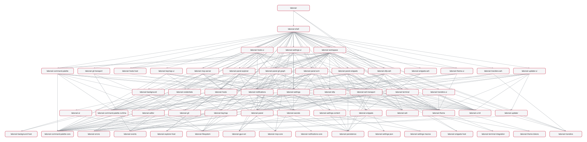

# Labonair-rust — Target Architecture

**Status:** authoritative. Every task of the architecture rework (T16-002 …
T22-001) references this document as the single source of truth. If a later task
is unclear, look here first — do not re-decide. The crate graph may still be
refined by a later task (e.g. a panel that ends up as a tab view), but every
deviation is written back into this file and noted in `handshake.md`.

Sources: `bericht-architektur-rework-roadmap.md` (planning report, §1–§2) and
`vergleichsbericht-zed-vs-rust.md` (Zed reference comparison). Zed pattern
sources are under `zed-refrence/zed/crates/`.

---

## 1. Philosophy

> **"The most efficient way to get your work done in Labonair — with maximum
> performance and modularity for personalization."**

Binding for every rework task:

1. **Simple, fixed base structure.** The app has exactly four visible zones plus
   one overlay layer — nothing more:
   * **Titlebar** — tabs only, plus **one** icon button on the right (dropdown:
     Settings / Profile / future entries).
   * **Workspace** — tab content plus a recursive split layout.
   * **Side Panels** — docks left / right / bottom, each holding several
     switchable panels.
   * **Statusbar** — left: the **panel controls** (one toggle per panel); right:
     the **info dropdowns** (Notifications with badge, CWD breadcrumb, Updater,
     Transfers, Agent-Access).
   * **Modal / Overlay layer** — command palette, dialogs, transient search,
     toasts.
2. **Personalization is first-class.** Statusbar items are movable between
   left/right and can be hidden via **right-click → context menu**. Panels are
   movable between docks. Themes and keymap are editable files. Settings apply
   globally **and** per project folder.
3. **Modularity in the code = modularity in the product.** Every feature unit is
   its own crate with a clear API. New panels / statusbar items / settings
   register themselves via traits — no central god-object touches them.
4. **Performance is measurable.** No per-frame work that per-event would
   suffice; no `cx.notify` without a state change; startup and build time are
   documented before and after the rework.

Parity with the reference app remains mandatory, but from here on it is the
*minimum*, not the goal.

---

## 2. Target crate graph (7 → ~22 crates)

```
labonair-app            (bin)   – only main(): runtime, backend init, window bootstrap

── Foundation ────────────────────────────────────────────────────────────────
labonair-gpui-ext               – prelude re-exports, GPUI helper traits, shared newtypes
labonair-ui-kit                 – design system: Button, IconButton, List, Dropdown,
                                  Select, Dialog, Popover, ContextMenu, Disclosure,
                                  Table, Tabs, Tooltip, Divider, Indicator, Badge,
                                  Banner, KeybindingHint, Kbd, Icon/IconName, file_icon,
                                  markdown renderer
labonair-theme        (extended) – ThemeRegistry, JSON theme families, icon themes,
                                  theme_settings layer (density / font / radius)
labonair-notifications          – NotificationCenter + toast rendering
labonair-command-palette        – palette UI + command / keybind model

── Settings track ────────────────────────────────────────────────────────────
labonair-settings-content       – typed SettingsContent tree + MergeFrom
labonair-settings               – SettingsStore (layer merge), Settings trait +
                                  registration, keymap.json loader, JSON surgical edit,
                                  schema generation
labonair-settings-ui            – settings window, pages, generated field renderers

── Workspace track ──────────────────────────────────────────────────────────
labonair-panel                  – contracts: Panel trait, PanelRegistry,
                                  StatusItem trait, StatusItemRegistry (breaks the cycle)
labonair-workspace              – Workspace, Pane, PaneGroup (split tree), Dock (L/R/B),
                                  StatusBar host, ModalLayer, ToastLayer host, persistence
labonair-shell                  – AppShell: composes titlebar + docks + workspace +
                                  statusbar + modal layer. Thin, no feature code.

── Panels (one crate each) ──────────────────────────────────────────────────
labonair-panel-explorer  · labonair-panel-scm  · labonair-panel-git-graph
labonair-panel-snippets  · labonair-panel-ai

── Host access (NOT a dock panel — see §8) ──────────────────────────────────
labonair-hosts-ui               – host connect list + host / credential editing
                                  UI. Management surface embedded by
                                  labonair-settings-ui (Settings › Hosts);
                                  connect surface fed to the command palette
                                  as data. No dock panel, no tab.

── Unchanged (possible later split) ─────────────────────────────────────────
labonair-terminal (engine) · labonair-editor · labonair-backend · labonair-ai
```

### 2.1 Per-crate purpose + source files

Today's monolith is `crates/ui/src/` (~40 files, ~48k lines; `settings.rs`
5 957, `workspace.rs` 4 076, `app_shell.rs` 2 983, `hosts.rs` / `ai_chat.rs` /
`git.rs` four-digit). The table below assigns each of today's
`crates/ui/src/*.rs` to its target crate.

| Target crate | Purpose (one sentence) | Today's source files |
|---|---|---|
| `labonair-app` (bin) | Only `main()`: tokio runtime, backend init, window bootstrap — no feature code. | `ui/assets.rs`, `ui/window_state.rs` (window part); today's `crates/app` |
| `labonair-gpui-ext` | Prelude re-exports, GPUI helper traits and shared newtypes so downstream crates import one path. | new (extracted helpers currently inlined across `ui/*.rs`) |
| `labonair-ui-kit` | The design system: every reusable primitive, bound to theme tokens; nothing feature-specific. | `ui/components/*` (`button.rs`, `context_menu.rs`, `icon.rs`, `text_field.rs`, `mod.rs`), `ui/markdown.rs` |
| `labonair-theme` (extended) | `ThemeRegistry`, JSON theme families, icon themes, syntax themes, terminal background images, density/font/radius layer. | `ui/theme.rs`, `ui/syntax_theme.rs`, `ui/background.rs`; today's `crates/theme` |
| `labonair-notifications` | `NotificationCenter` + toast rendering; usable from panels and shell. | `ui/notifications.rs` |
| `labonair-command-palette` | Palette UI plus the command / keybind model shared with the keymap. | `ui/command_palette.rs` |
| `labonair-settings-content` | Typed `SettingsContent` tree + `MergeFrom` trait (derives / replaces `Preferences`). | new, derived from the `Preferences` types currently in `ui/settings.rs` |
| `labonair-settings` | `SettingsStore` (layer merge), `Settings` trait + registration, `keymap.json` loader, comment-preserving JSON surgical edit, schema generation. | new, extracted from the store logic in `ui/settings.rs` |
| `labonair-settings-ui` | Settings window, pages, generated per-type field renderers. | `ui/settings.rs` (UI part: pages, `FIELDS`/`SECTION_GROUPS` stay unchanged initially) |
| `labonair-panel` | Contracts only: `Panel` trait, `PanelRegistry`, `StatusItem` trait, `StatusItemRegistry` — signatures ported from Zed, initially unused. Breaks the Panel ↔ Workspace cycle. | new; trait extraction target of `ui/sidebar_slot.rs` and the `BarItemId` model in `ui/bar_items.rs` |
| `labonair-workspace` | `Workspace`, `Pane`, `PaneGroup` (recursive split tree), `Dock` (L/R/B), `StatusBar` host, `ModalLayer`, `ToastLayer` host, layout/session persistence. | `ui/workspace.rs`, `ui/pane.rs`, `ui/tabs.rs`, `ui/sidebar_slot.rs`, `ui/session.rs`, `ui/window_state.rs` (persistence part), `ui/preview.rs`, `ui/sftp.rs`, `ui/terminal.rs` (view), `ui/editor.rs` (view), `ui/diff.rs` (view) — terminal/editor/sftp views stay here for now (§7 of the report); `ui/bookmarks.rs` moved on to `labonair-panel-explorer` in T16-008 (§8.4) |
| `labonair-shell` | `AppShell`: composes titlebar + docks + workspace + statusbar + modal layer; the only crate that knows concrete panel types (registration). Thin, no feature code. | `ui/app_shell.rs`, `ui/lib.rs`, `ui/menu.rs`, `ui/bar_items.rs` (concrete items), `ui/cwd_breadcrumb.rs`, `ui/transfers.rs` (statusbar item + progress UI), `ui/updater.rs`, `ui/agent_access.rs` |
| `labonair-panel-explorer` | File-explorer panel (also hosts the path-bookmarks overlay view — see §8.4). | `ui/explorer.rs`, `ui/bookmarks.rs` |
| `labonair-panel-scm` | Source-control (status / staging) panel. | `ui/git.rs` |
| `labonair-panel-git-graph` | Commit-graph panel. | `ui/git_graph.rs` |
| `labonair-hosts-ui` | Host connect list + host / credential editing UI. **Not a dock panel and not a tab** (see §8): the connect surface is rendered by the command palette (`Enter` = SSH, `Shift+Enter` = SFTP), the management surface is embedded in **Settings › Hosts** (a first-class top-level category). | `ui/hosts.rs`, `ui/ssh_connection.rs` |
| `labonair-panel-snippets` | Command-snippets panel. | `ui/snippets.rs` |
| `labonair-panel-ai` | AI-chat panel. | `ui/ai_chat.rs`, `ui/ai_composer.rs`, `ui/live_bridge.rs` |
| `labonair-terminal` | Terminal engine (alacritty), unchanged; audible bell. | today's `crates/terminal`, `ui/bell.rs` |
| `labonair-editor` | TreeSitter editor core, unchanged. | today's `crates/editor` |
| `labonair-backend` | SSH / SFTP / Git / PTY / SQLite / keyring, unchanged; no UI deps. | today's `crates/backend` |
| `labonair-ai` | AI providers / streaming / tools, unchanged; no UI deps. | today's `crates/ai` |

> **T16-006 outcome note.** `labonair-workspace` was extracted with its full
> structural closure: `workspace.rs` (lib root), `pane.rs` + `pane_group.rs`
> (recursive split tree split out), `session.rs`, `live_bridge.rs`, `tabs.rs`,
> `agent_access.rs`, `background.rs`, `bell.rs`, `markdown.rs`, `syntax_theme.rs`,
> `drag.rs` (extracted from `explorer.rs`), `prefs.rs` (`GlobalPreferences`
> newtype extracted from `ui/settings.rs`), the `AskAboutSelection` action, and
> the tab-content views under `src/views/` (`terminal`, `editor`, `sftp`,
> `preview`, `ssh_connection`, `git_graph`, `diff`, `hosts`). **`views/hosts.rs`
> and `transfers.rs` are acknowledged *temporary* residents** — `Workspace` owns
> `Entity<HostManagerView>` / `Entity<TransfersView>` today; `hosts` moves to
> `labonair-hosts-ui` (T16-008 — **not** a panel crate; see §8) and `transfers`
> to `labonair-shell` later (see `TODO(T16-008)` / `TODO(shell)` at those module
> heads). The `TabKind::Home` host-manager tab is removed in T17-009; the
> management UI re-surfaces in **Settings › Hosts** (T19-010). The runtime
> `ThemeStore` (+ `ThemeMode`, `FontOverrides`, `GlobalTheme`, `init`,
> `init_fonts`, `theme_store`, `active_theme`, `modal_scrim`, `SCROLLBAR_SIZE`,
> `menu_metrics`) moved from `ui/theme.rs` into `labonair_theme::store`; the
> `impl labonair_ui_kit::UiTheme for ThemeStore` lives in `crates/ui-kit`
> (orphan rule — `labonair-theme` must not depend on `labonair-ui-kit`).
> `crates/ui` keeps thin `pub use` shims for every moved symbol.

> **T16-009 outcome note.** `crates/ui` is **deleted**. `labonair-shell`
> (`crates/shell/`, lib root `src/shell.rs`) now owns the last real files that
> lived in the monolith: `app_shell.rs` (unchanged — its diet is T17-006),
> `menu.rs` (native macOS menu bar + `apply_keybinds`), `window_state.rs`
> (window-geometry persistence), `assets.rs` + the `assets/icons/` SVG bundle
> (`include_bytes!` paths are crate-relative — moved together), and the
> shell-near helpers `updater.rs`, `cwd_breadcrumb.rs`, `sidebar_slot.rs`
> (Phase 17 may re-home these as statusbar items). `no_pictograph_icons.rs`
> moved to `crates/shell/tests/`.
>
> **Theme-store home (task instruction 3): decided = `labonair-theme`.** No
> further move — T16-006 already relocated the runtime `ThemeStore` closure to
> `labonair_theme::store`, and `background`/`syntax_theme`/`markdown`/`tabs`
> already live in `labonair-workspace` (T16-006). Task instructions 3–4
> proposed relocations that T16-006 superseded; T16-009 only confirms the
> current homes. `crates/app` reaches every init hook through one
> `labonair_shell::` import root — `labonair-shell` re-exports
> `labonair_theme::{init_fonts, init_theme}`,
> `labonair_notifications::init as init_notifications` and
> `labonair_workspace::background::init as init_background`, so `main.rs`
> changed import paths only (no bootstrap logic). Inside `labonair-shell`,
> `crate::{background,bar_items,live_bridge,pane,session,theme,workspace}` are
> `pub(crate)` re-export shims forwarding to `labonair-workspace` /
> `labonair-theme`, so `app_shell.rs` / `updater.rs` moved byte-for-byte.
>
> `transfers.rs` / `views/hosts.rs` stay in `labonair-workspace` for now
> (`Workspace` still owns `Entity<TransfersView>` / `Entity<HostManagerView>`);
> decoupling them into `labonair-shell` is deferred to the T17 workspace/shell
> rework rather than done here (would be a logic refactor, out of T16-009
> scope). `labonair-shell` deps: `labonair-workspace` + `labonair-settings-ui`
> + all five `labonair-panel-*` + `labonair-command-palette` +
> `labonair-notifications` + `labonair-theme` + `labonair-ui-kit` +
> `labonair-gpui-ext` + `labonair-terminal` + `labonair-backend`. `crates/app`
> now depends on `labonair-shell` (not `labonair-ui`); no crate has a
> `labonair-ui` edge.

---

## 3. Dependency rules (binding — CI-checked in T16-010)

These are stated so T16-010 can derive a mechanical check (e.g. `cargo-depgraph`
+ an allow-list assertion):

> **T16-010:** these rules are now enforced mechanically by
> [`scripts/check-crate-deps.sh`](../scripts/check-crate-deps.sh) (a per-crate
> allow-list over `cargo metadata` + a transitive traversal for acyclicity and
> the "must-not-reach" invariants). CI runs it as the `crate-deps` job in
> `.github/workflows/ci.yml`; a PR that adds a forbidden edge goes red. Two
> pre-existing, accepted deviations are encoded in the allow-list with inline
> comments and listed in §8.5. The realised graph is in §9.

1. **`labonair-panel` depends on no crate of the workspace track** — not on
   `labonair-workspace`, not on `labonair-shell`. This breaks the cycle "panels
   need workspace types, workspace needs the panel trait".
2. **Panel crates** (`labonair-panel-*`) depend only on `labonair-panel` +
   `labonair-ui-kit` + `labonair-theme` + `labonair-backend` (and optionally
   `labonair-terminal` / `labonair-editor` / `labonair-ai`). They depend
   **never on each other**, **never on `labonair-shell`**, **never on
   `labonair-workspace`**.
3. **`labonair-shell` is the only crate that knows concrete panel types.** It
   depends on `labonair-workspace` + `labonair-panel` + every `labonair-panel-*`
   + `labonair-settings-ui` + `labonair-notifications` +
   `labonair-command-palette`, and performs registration.
4. **`labonair-backend`, `labonair-ai`, `labonair-terminal` (engine),
   `labonair-editor` depend on no UI crate** — no `gpui`, no `gpui-component`,
   no `labonair-ui-kit`/`-theme`/`-workspace`/`-shell`.
5. **`labonair-ui-kit` depends only on** `gpui`, `gpui-component`,
   `labonair-theme`, `labonair-gpui-ext`. No feature crate, no workspace crate,
   no panel crate.
6. **`labonair-gpui-ext` depends only on** `gpui` / `gpui-component` (and small
   utility crates). It is a leaf below `ui-kit`.
7. **Settings track:** `labonair-settings-content` has no UI dep;
   `labonair-settings` depends on `labonair-settings-content` (+ `gpui` for the
   store handle) but not on `labonair-settings-ui`; `labonair-settings-ui`
   depends on `labonair-settings` + `labonair-ui-kit` (+ `labonair-hosts-ui`
   for the Hosts category, see rule 9).
8. **The crate graph is acyclic.** Verified in CI (T16-010).
9. **`labonair-hosts-ui` is not a panel crate.** It depends only on
   `labonair-backend` (hosts, ssh, keyring) + `labonair-ui-kit` +
   `labonair-theme`. It depends on **no** `labonair-workspace` / `-shell` /
   `-panel*` — opening a tab is passed in as a callback. `labonair-settings-ui`
   depends on it (embeds the management page). `labonair-command-palette` does
   **not** depend on it: the shell injects the host list + connect callbacks
   into the palette as data (the reference's `RegistryCallbacks` pattern).

---

## 4. Layout contract (binding)

```
┌─ Titlebar ────────────────────────────────────────────────────────────────┐
│  [Tab] [Tab] [Tab] [＋▾]                                          [◉ ▾]     │  ← tabs + new-tab menu (left) + 1 button (right)
├─ Docks + Workspace ──────────────────────────────────────────────────────┤
│ ┌ left dock ┐                                              ┌ right dock ┐ │
│ │  Panel    │            Workspace (split tree)            │   Panel    │ │
│ └───────────┘                                              └────────────┘ │
│ ┌ bottom dock ─────────────────────────────────────────────────────────┐ │
│ │  Panel                                                                │ │
│ └──────────────────────────────────────────────────────────────────────┘ │
├─ Statusbar ──────────────────────────────────────────────────────────────┤
│ [Explorer][SCM][Git][Snippets][AI]  ················  [⟳][CWD ▸][🔔³] │
│  └─ panel toggles (left, default) ──┘   └─ info dropdowns (right) ────────┘│
└──────────────────────────────────────────────────────────────────────────┘
   Overlay layer: command palette · dialogs · Cmd+F search · toasts
```

* **Titlebar** — tabs plus, at the left end of the tab strip, a **`＋▾`
  new-tab menu button** (Terminal / Editor / Preview / Git Graph · separator ·
  `SSH ▸` recent-hosts submenu · `SFTP ▸` recent-hosts submenu · `Host
  settings…`). On the right, exactly **one** icon button `[◉ ▾]` → dropdown:
  `Settings…`, `Profile` (placeholder), separator, room for planned entries.
  The `＋▾` menu counts as part of the tab strip, not a second right-hand
  button — the contract still holds. The macOS traffic-light inset stays.
* **Workspace** — the active tab's content plus the recursive `Member::Axis`
  split tree. **May hold zero tabs** — then it renders the empty surface:
  a centred hint with the key shortcuts; double-click opens a local terminal;
  a dropped file opens an editor tab.
* **Side Panels** — `Dock` on left / right / bottom; each dock holds several
  registered panels, one active, resizable, zoomable, persisted.
* **Statusbar** — left: one toggle per registered panel (from `PanelRegistry`;
  five — Explorer, SCM, Git-Graph, Snippets, AI), active highlighted. Right:
  info dropdowns — Notifications (badge dropdown), CWD breadcrumb, Updater,
  Transfers, Agent-Access, Jump-Hosts — each a `StatusItem`.
* **Modal / Overlay layer** — `ModalLayer` (command palette, dialogs, bookmarks,
  updater modal, transient `Cmd+F` search) and `ToastLayer` (toasts). Nothing
  else renders overlays.

### What is removed

* **Header inline search** in the titlebar — gone. Replaced by a transient
  `Cmd+F` overlay in the modal/overlay layer (no permanent chrome surface).
* **The `⋯` app-menu button** — gone. Replaced by the single `[◉ ▾]` titlebar
  dropdown.
* **The 44 px "activity rail"** (an invention flagged in `subagent-1.md`) —
  gone. Panel switching runs through the statusbar toggles.
* **The titlebar scope of bar items.** The old `barItemPlacements` schema had a
  titlebar side; the new `statusBarItemPlacements`
  (`{ itemId: { side, hidden } }`) has only `left` / `right` + `hidden`.
  Titlebar-scoped items map to the statusbar default (migrator T18-006).
* **`drain_pending_*` frame buffers** in `render()` — gone; events are handled
  directly via `cx.subscribe_in` / `window.defer`.
* **The Host-Manager tab and the `SidebarPanel::Hosts` list** — gone. Not a
  tab, not a dock panel. Connecting to a host runs through the command-palette
  **Hosts** page (`Enter` = SSH, `Shift+Enter` = SFTP), quick-connect rows at
  palette root, the titlebar `＋▾` submenu, and the native menu; `Cmd+Shift+N`
  opens the Hosts page. Adding / editing hosts and credentials lives in
  **Settings › Hosts**, a first-class top-level category. (§8.1)
* **The "always at least one tab" rule** — gone. Closing every tab yields the
  empty workspace surface; `TabKind::Home` is deleted. `startup_tab` gains an
  `empty` value; an empty last session restores empty. (§8.2)

The native macOS menu bar stays (parity); the titlebar dropdown is the
cross-platform, discoverable second path.

---

## 5. Pattern catalog — what we copy 1:1 from Zed

| Area | Zed source | What we take |
|---|---|---|
| Panel / Dock | `zed-refrence/zed/crates/workspace/src/dock.rs` | `Panel` trait (`position`, `set_position`, `default_size`, `min_size`, `PanelEvent`), `DockPosition` |
| Statusbar items | `zed-refrence/zed/crates/workspace/src/status_bar.rs` | `StatusItemView` + `HideStatusItem` — the item describes hiding itself |
| Split layout | `zed-refrence/zed/crates/workspace/src/pane_group.rs` | recursive `Member::Axis` tree + persistence |
| Overlay layers | `zed-refrence/zed/crates/workspace/src/modal_layer.rs`, `zed-refrence/zed/crates/workspace/src/toast_layer.rs` | reusable `ModalLayer` / `ToastLayer` types |
| Settings model | `zed-refrence/zed/crates/settings_content/`, `zed-refrence/zed/crates/settings/src/merge_from.rs` | typed tree + `MergeFrom` |
| Settings store | `zed-refrence/zed/crates/settings/src/settings_store.rs`, `zed-refrence/zed/crates/settings_macros/` | `Settings` trait + `RegisterSetting` derive + `inventory`, layer merge |
| JSON edit | `zed-refrence/zed/crates/settings_json/` (`update_value_in_json_text`) | comment- and format-preserving surgical edits |
| Settings-UI generation | `zed-refrence/zed/crates/settings_ui/src/settings_ui.rs`, `zed-refrence/zed/crates/settings_ui/src/page_data.rs` | `SettingField<T>{ pick }` + a `SettingFieldRenderer` registry per type, `SettingsPageItem` |
| Keymap | `zed-refrence/zed/crates/settings/src/keymap_file.rs`, `zed-refrence/zed/crates/settings/src/base_keymap_setting.rs`, `zed-refrence/zed/assets/keymaps/` | `keymap.json` with contexts + chords, validators |
| Theme | `zed-refrence/zed/crates/theme/src/registry.rs`, `zed-refrence/zed/crates/theme/src/theme.rs`, `zed-refrence/zed/crates/theme/src/icon_theme.rs`, `zed-refrence/zed/crates/theme/src/settings.rs` | `ThemeRegistry`, JSON families, icon themes, density layer |
| UI-kit + gallery | `zed-refrence/zed/crates/ui/src/components/`, `zed-refrence/zed/crates/component/`, `zed-refrence/zed/crates/component_preview/` | primitive set + live-preview page |

---

## 6. Settings layers (overview — detail in Phase 18)

The `SettingsStore` merges configuration in this fixed order, later layers
overriding earlier ones:

```
default  →  user  →  OS  →  project  →  language
```

* **default** — compiled-in defaults (the `SettingsContent` defaults).
* **user** — the global `settings.json` in the user config dir.
* **OS** — platform overrides (e.g. macOS-specific keys).
* **project** — `.labonair/settings.json` in an opened folder (a whitelisted
  subset of keys; use cases: per-repo default host, start layout, snippet set).
* **language** — per-language overrides for editor keys.

`keymap.json` is a parallel file with the same layering (default keymap →
user keymap). `enum ShortcutId` is only the default source.

---

## 7. Naming convention

* Every new crate is named **`labonair-<name>`** (e.g. `labonair-ui-kit`,
  `labonair-panel-explorer`).
* Its directory is **`crates/<name>/`** (without the `labonair-` prefix, e.g.
  `crates/ui-kit/`, `crates/panel-explorer/`).
* `[lib] path` is set **explicitly** to `crates/<name>/src/<name>.rs`
  (e.g. `crates/ui-kit/src/ui_kit.rs`), following the Zed `CLAUDE.md`
  recommendation — the crate root file is named after the crate, not `lib.rs`.
* Existing crates (`app`, `terminal`, `editor`, `backend`, `ai`, `theme`) are
  renamed to the `labonair-<name>` package name over the rework; `crates/ui`
  becomes a shrinking facade and is deleted in T16-009.

---

## 8. Deviations recorded after T16-001 (workflow rework)

The header rule of this file: *every deviation from the T16-001 plan is written
back here.* These three come from the tab / host-access / settings workflow
rework agreed after T16-005. They **extend** the plan — the registry patterns,
dependency rules and acyclic graph are unchanged. Rationale:
[`bericht-workflow-rework.md`](../bericht-workflow-rework.md).

### 8.1 Host access — no Host-Manager tab, no hosts panel

`labonair-panel-hosts` is **dropped** from the crate graph. The SSH host
manager splits into two surfaces:

* **Connect** — the command palette gains a single **Hosts** page (replacing
  the separate `HostsSsh` / `HostsSftp` pages): one row per host,
  `Enter` = open SSH terminal, `Shift+Enter` = open SFTP, with a footer hint
  bar. The most-recent hosts also appear as quick-connect rows at palette root.
  `Cmd+Shift+N` opens the Hosts page. The titlebar `＋▾` menu and the native
  menu keep an `SSH ▸` / `SFTP ▸` recent-hosts submenu.
* **Manage** — **Settings › Hosts**, a first-class top-level settings category
  (peer of Themes): add / edit / delete / duplicate hosts, credentials via
  keyring, jump-hosts, tunnels, SSH-config import/export, availability polling.

View code (`ui/hosts.rs`, `ui/ssh_connection.rs`) moves to **`labonair-hosts-ui`**
in T16-008 — a plain view crate, **not** a `labonair-panel-*` crate, with no
`impl Panel`. `labonair-settings-ui` depends on it and embeds the management
page (T19-010). The palette receives the host list + connect callbacks as
injected data from the shell (no `labonair-command-palette` → `labonair-hosts-ui`
edge). `enum SidebarPanel` (incl. `Hosts`) and the `TabKind::Home` host tab are
deleted (T17-001 / T17-009).

Tasks: T16-007 (palette Hosts page + secondary action), T16-008
(`labonair-hosts-ui`), T17-001 (drop from `PanelRegistry`), T19-001
(`hosts` area in `SettingsContent`), T19-010 (Settings › Hosts page).

### 8.2 Tabs are optional — empty workspace surface

`TabKind::Home` is removed. The workspace may hold **zero** tabs and then
renders the empty surface (centred shortcut hint; double-click → local
terminal; dropped file → editor tab). `close`/`close_all` no longer stop at
one tab. `PaneGroup`'s root is optional (empty = no split tree). `startup_tab`
gains `empty`; session-restore of an empty last state stays empty (respecting
`session_restore`). The titlebar `＋▾` menu and the command palette re-open any
tab type.

Tasks: T17-004 (optional `PaneGroup` root), T17-006 (empty render path),
T17-009 (the `Option<ActiveTab>` audit + `TabKind::Home` removal + empty
surface), T18-001 (`＋▾` menu + empty-surface visuals).

### 8.3 Settings design contract

A written contract — [`docs/settings-guidelines.md`](./settings-guidelines.md),
created in **T19-000** before any other Phase 18 task — governs every settings
page so they cannot drift the way the Tauri version did:

1. One navigation model: **top-level category → in-page disclosure section →
   optional sub-page** (`SubPageLink`). No category deviates.
2. Every setting is a typed field in `SettingsContent` with metadata (title,
   description, unit, range, `requires_restart`). No setting exists only in UI.
3. The field UI is **generated from the Rust type** via the renderer registry
   (T19-004). No bespoke toggles.
4. **Custom panes** (Themes, Hosts, Shortcuts, AI providers, MCP) are a
   sanctioned first-class registration path — a `SettingsPage { kind: Custom }`
   that can also be a **top-level category** — not a hack around the registry.
   They still render inside the standard page chrome (header, search, origin
   badges).
5. Every field shows its effective layer (default / user / project) + a reset
   affordance. Search covers every page (T19-007). Every category and section
   has a stable deep-link slug.

Tasks: T19-000 (contract doc + `CLAUDE.md` rule), T19-001 (`hosts` +
`personalization` as areas; custom-category marker), T19-004 (disclosure nav +
custom top-level category path), T19-010 (Hosts as the first new custom
top-level category).

### 8.4 Bookmarks live in `labonair-panel-explorer` (no `panel-bookmarks` crate)

T16-008 default taken: the path-bookmarks overlay (`ui/bookmarks.rs` →
`BookmarksView` / `BookmarkEvent`) moves into **`labonair-panel-explorer`** as a
`bookmarks` submodule rather than its own crate — bookmarks are directory-near
and the view already couples to `ExplorerView` (needs the local explorer root).
It stays an `EventEmitter` overlay view: `AppShell` keeps `self.bookmarks:
Entity<BookmarksView>` and renders it as an overlay (unchanged semantics); the
crate boundary is the only thing that moved.

Directed edges added in T16-008 (all acyclic): `labonair-workspace` →
`labonair-hosts-ui` and → `labonair-panel-git-graph` (it owns the tab-view
entities); `labonair-panel-{explorer,snippets,ai}` → `labonair-workspace`
(`Workspace`, `markdown`, `syntax_theme`, `agent_access`). `labonair-hosts-ui`
and `labonair-panel-git-graph` do **not** depend on `labonair-workspace`, so no
cycle. `AgentAccessStore` stays in `labonair-workspace::agent_access` and is
re-exported by `labonair-panel-ai`.

### 8.5 Accepted deviations from the §3 allow-list (T16-010)

`scripts/check-crate-deps.sh` encodes two edges that the literal §3 wording
would reject but that predate the rework and are kept deliberately (each is
commented `[deviation]` in the script):

1. **`labonair-terminal → labonair-theme`.** Rule 4 says the terminal *engine*
   pulls no UI crate. `labonair-terminal` today also renders GPUI cells and
   reads its ANSI palette from `labonair-theme` (a leaf token crate, no
   transitive UI). It reaches nothing else. A deeper engine/renderer split is
   left as future work (tracked in `docs/perf-baseline.md`).
2. **`labonair-panel-ai → labonair-command-palette` and `→ labonair-editor`.**
   Rule 2's optional list covers `terminal`/`editor`/`ai`; `panel-ai` also uses
   the command-palette's slash-command model and the editor buffer for its
   composer. No panel→panel or panel→shell edge is introduced.

The panel crates transitively reach `labonair-panel-git-graph` *through*
`labonair-workspace` (§8.4 — workspace owns that tab-view entity). That
indirection is sanctioned; the check only forbids a **direct** panel→panel
edge and reaching `labonair-shell` by **any** path.

---

## 9. Ist-Graph after Phase 15 (T16-010)

Regenerate with [`scripts/gen-crate-graph.sh`](../scripts/gen-crate-graph.sh)
(writes `docs/assets/crate-graph.dot` + `.svg` and prints this list).



<!-- generated by scripts/gen-crate-graph.sh — do not edit by hand -->
20 workspace crates, 81 internal edges, 8 tiers.

- `labonair` → `labonair-ai`, `labonair-backend`, `labonair-editor`, `labonair-shell`, `labonair-terminal`, `labonair-theme`
- `labonair-ai` → `labonair-backend`
- `labonair-backend` → *(leaf)*
- `labonair-command-palette` → `labonair-backend`, `labonair-gpui-ext`, `labonair-theme`, `labonair-ui-kit`
- `labonair-editor` → *(leaf)*
- `labonair-gpui-ext` → *(leaf)*
- `labonair-hosts-ui` → `labonair-backend`, `labonair-notifications`, `labonair-theme`, `labonair-ui-kit`
- `labonair-notifications` → `labonair-gpui-ext`, `labonair-theme`, `labonair-ui-kit`
- `labonair-panel` → `labonair-gpui-ext`
- `labonair-panel-ai` → `labonair-ai`, `labonair-backend`, `labonair-command-palette`, `labonair-editor`, `labonair-theme`, `labonair-ui-kit`, `labonair-workspace`
- `labonair-panel-explorer` → `labonair-backend`, `labonair-notifications`, `labonair-theme`, `labonair-ui-kit`, `labonair-workspace`
- `labonair-panel-git-graph` → `labonair-backend`, `labonair-notifications`, `labonair-theme`, `labonair-ui-kit`
- `labonair-panel-scm` → `labonair-backend`, `labonair-notifications`, `labonair-theme`, `labonair-ui-kit`
- `labonair-panel-snippets` → `labonair-backend`, `labonair-notifications`, `labonair-theme`, `labonair-ui-kit`, `labonair-workspace`
- `labonair-settings-ui` → `labonair-ai`, `labonair-backend`, `labonair-command-palette`, `labonair-gpui-ext`, `labonair-notifications`, `labonair-theme`, `labonair-ui-kit`, `labonair-workspace`
- `labonair-shell` → `labonair-backend`, `labonair-command-palette`, `labonair-gpui-ext`, `labonair-notifications`, `labonair-panel-ai`, `labonair-panel-explorer`, `labonair-panel-git-graph`, `labonair-panel-scm`, `labonair-panel-snippets`, `labonair-settings-ui`, `labonair-terminal`, `labonair-theme`, `labonair-ui-kit`, `labonair-workspace`
- `labonair-terminal` → `labonair-theme`
- `labonair-theme` → *(leaf)*
- `labonair-ui-kit` → `labonair-gpui-ext`, `labonair-theme`
- `labonair-workspace` → `labonair-ai`, `labonair-backend`, `labonair-command-palette`, `labonair-editor`, `labonair-gpui-ext`, `labonair-hosts-ui`, `labonair-notifications`, `labonair-panel`, `labonair-panel-git-graph`, `labonair-terminal`, `labonair-theme`, `labonair-ui-kit`

`labonair-settings-content` / `labonair-settings` (§2, settings track) are not
yet created — they land in Phase 18. `labonair-panel` is present as the
contracts crate but is not yet consumed by any panel (`Panel` trait wiring is
T17-001).
